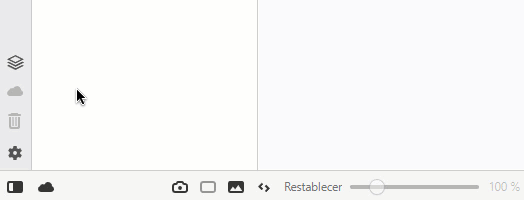
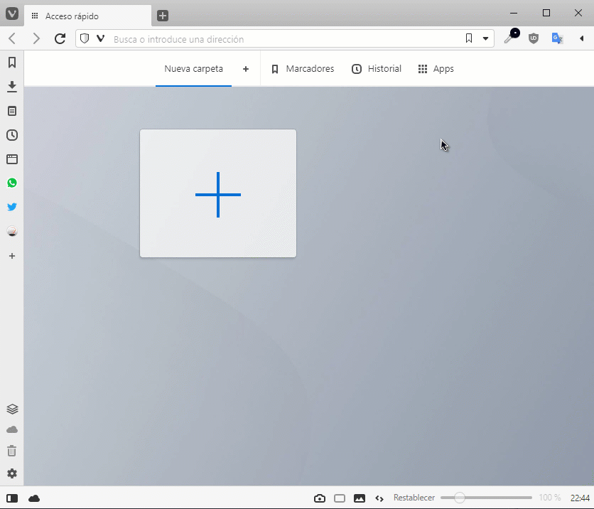

# Vivaldi Browser - Mods

## List of modifications

    - Sync icons in sidebar.
    - Toggle icon for the status bar is added in the sidebar.
    - Link to chrome apps in speed dial header

## Previews

## Installation

> 1º Go to Menu > Tools > Settings > Appearance.
>
> 2º Select: Show Status Bar (in Status Bar section).
>
> 3º Install modification (use windows_install.bat for windows | use linux_install.sh for linux (root) | use mac_install.sh for Mac OS X (root)).
