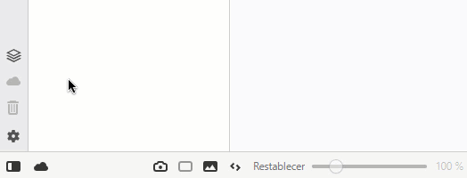

# Vivaldi Browser - Mods

## List of modifications

    - Sync icons in sidebar.
    - Toggle icon for the status bar is added in the sidebar.

## Preview

## Installation

> 1º Go to Menu > Tools > Settings > Appearance.
>
> 2º Select: Show Status Bar (in Status Bar section).
>
> 3º Install modification (use windows_install.bat for windows | use linux_install.sh for linux (root) | use mac_install.sh for Mac OS X (root)).

## Trello

[Go to Trello](https://trello.com/b/epKD1wmQ/vivaldi-mods)

## Changelogs

### > 1.0.6 / 2019-06-14

    - (Changed) Translation of the linux installer is corrected

### > 1.0.5 / 2019-05-02

    - (Changed) Linux installer translated to english

### > 1.0.4 / 2019-05-02

    - (Added) Mac OS X installer

### > 1.0.3 / 2019-04-01

    - (Added) Linux installer

### > 1.0.2 / 2019-04-01

    - (Changed) Now the new button is synchronized with the status bar.

### > 1.0.1 / 2019-03-30

    - (Fixed) If the status bar is deactivated, the new button won't be displayed.

### > 1.0.0 / 2019-03-30

    - (Added) Sync icons in sidebar.
    - (Added) Toggle icon for the status bar is added in the sidebar.